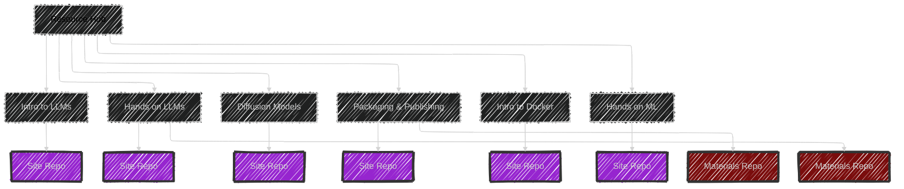

# Accelerate Science Resource Hub
The Accelerate Science Resource Hub to support researchers across the University using AI in their work

```mermaid
---
config:
  layout: elk
  look: handDrawn
  theme: dark
---
graph TD
    A[Resource Hub]

    B[Intro to LLMs] --> B1[Site Repo]

    C[Hands on LLMs] --> C1[Site Repo]

    D[Diffusion Models] --> D1[Site Repo]

    E[Packaging & Publishing] --> E1[Site Repo]
    F[Intro to Docker] --> F1[Site Repo]
    G[Hands on ML] --> G1[Site Repo]

    
    E ---> M[Materials Repo]
    C ---> N[Materials Repo]
    
    A --> B
    A --> C
    A --> D
    A --> E
    A --> F
    A --> G

    classDef clickNode text-decoration:none,color:inherit;
    class A clickNode;

    classDef siteRepo fill:#9625cf,stroke:#333,stroke-width:4px;
    class B1,C1,D1,E1,F1,G1 siteRepo;

    classDef matRepo fill:#7a0d0d,stroke:#333,stroke-width:4px;
    class M,N matRepo;

    click A href "https://docs.science.ai.cam.ac.uk/"
    
```