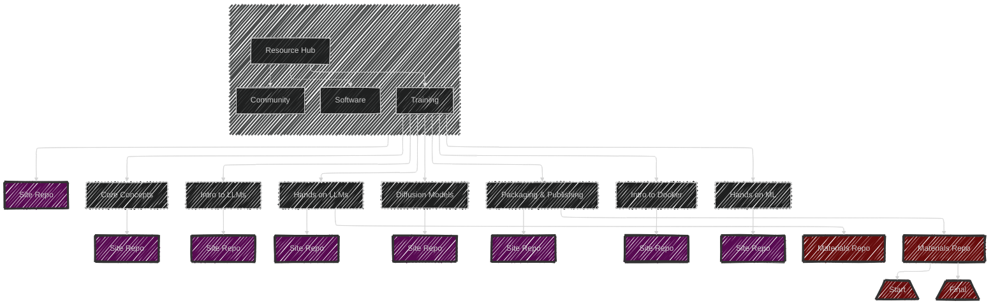

<!-- Improved compatibility of back to top link: See: https://github.com/othneildrew/Best-README-Template/pull/73 -->

<!-- PROJECT SHIELDS -->
<!-- [![Contributors][contributors-shield]][contributors-url]
[![Forks][forks-shield]][forks-url]
[![Stargazers][stars-shield]][stars-url]
[![Issues][issues-shield]][issues-url]
[![GPL License][license-shield]][license-url] -->

 

<!-- [![LinkedIn][linkedin-shield]][linkedin-url] -->

<!-- PROJECT LOGO -->
 

  

  <h3 align="center">Accelerate Science Resource Hub</h3>

  

    The Accelerate Science Resource Hub to support researchers across the University using AI in their work.
  

  

    <!-- <a href="https://acceleratescience.github.io/diffusion-models/" style="font-size: 20px; text-decoration: none"><strong>Start »</strong></a>
     
      -->
    <a href="https://github.com/acceleratescience/large-language-models/issues">Report Bug</a>
    ·
    <a href="https://github.com/acceleratescience/large-language-models/issues">Request Feature</a>
     
  

<!-- TABLE OF CONTENTS -->

  
Table of Contents

  <ol>
    <li><a href="#overview">Overview</a></li>
    <li><a href="#contributing">Contributing</a></li>
    <li><a href="#license">License</a></li>
  </ol>

<!---------------------------------------------------------------------------->

[Button Shield]: https://img.shields.io/badge/Shield_Buttons-37a779?style=for-the-badge

[License]: LICENSE
[Shield]: Types/Shield.md
[#]: #

<!---------------------------------[ Badges ]---------------------------------->

[Badge License]: https://img.shields.io/badge/-BY_SA_4.0-ae6c18.svg?style=for-the-badge&labelColor=EF9421&logoColor=white&logo=CreativeCommons
[Badge Likes]: https://img.shields.io/github/stars/MarkedDown/Buttons?style=for-the-badge&labelColor=d0ab23&color=b0901e&logoColor=white&logo=Trustpilot

## Current Site Map
The Resource Hub links to several Accelerate Science Workshops and their associated repos. Below is a clickable map that will take you to the appropriate site.

<!-- CONTRIBUTING -->
## Contributing

Contributions are what make the open source community such an amazing place to learn, inspire, and create. Any contributions you make are **greatly appreciated**.

If you have a suggestion that would make this better, please fork the repo and create a pull request. You can also simply open an issue with the tag "enhancement".
Don't forget to give the project a star! Thanks again!

1. Fork the Project
2. Create your Feature Branch (`git checkout -b feature/AmazingFeature`)
3. Commit your Changes (`git commit -m 'Add some AmazingFeature'`)
4. Push to the Branch (`git push origin feature/AmazingFeature`)
5. Open a Pull Request

(<a href="#readme-top">back to top</a>)

<!-- LICENSE -->
## License

Distributed under a GNU GPL-3.0 License. See `LICENSE` for more information.

(<a href="#readme-top">back to top</a>)

<!-- MARKDOWN LINKS & IMAGES -->
<!-- https://www.markdownguide.org/basic-syntax/#reference-style-links -->
[contributors-shield]: https://img.shields.io/github/contributors/acceleratescience/resource-hub.svg?style=for-the-badge
[contributors-url]: https://github.com/acceleratescience/resource-hub/graphs/contributors
[forks-shield]: https://img.shields.io/github/forks/acceleratescience/resource-hub.svg?style=for-the-badge
[forks-url]: https://github.com/acceleratescience/packaging-publishing/network/members
[stars-shield]: https://img.shields.io/github/stars/acceleratescience/resource-hub.svg?style=for-the-badge
[stars-url]: https://github.com/acceleratescience/resource-hub/stargazers
[issues-shield]: https://img.shields.io/github/issues/acceleratescience/resource-hub.svg?style=for-the-badge
[issues-url]: https://github.com/acceleratescience/resource-hub/issues
[license-shield]: https://img.shields.io/github/license/acceleratescience/resource-hub.svg?style=for-the-badge
[license-url]: https://github.com/acceleratescience/resource-hub/blob/master/LICENSE.txt
[linkedin-shield]: https://img.shields.io/badge/-LinkedIn-black.svg?style=for-the-badge&logo=linkedin&colorB=555
[linkedin-url]: https://linkedin.com/company/accelerate-programme-for-scientific-discovery/
[product-screenshot]: images/screenshot.png
[Next.js]: https://img.shields.io/badge/next.js-000000?style=for-the-badge&logo=nextdotjs&logoColor=white
[Next-url]: https://nextjs.org/
[React.js]: https://img.shields.io/badge/React-20232A?style=for-the-badge&logo=react&logoColor=61DAFB
[React-url]: https://reactjs.org/
[Vue.js]: https://img.shields.io/badge/Vue.js-35495E?style=for-the-badge&logo=vuedotjs&logoColor=4FC08D
[Vue-url]: https://vuejs.org/
[Angular.io]: https://img.shields.io/badge/Angular-DD0031?style=for-the-badge&logo=angular&logoColor=white
[Angular-url]: https://angular.io/
[Svelte.dev]: https://img.shields.io/badge/Svelte-4A4A55?style=for-the-badge&logo=svelte&logoColor=FF3E00
[Svelte-url]: https://svelte.dev/
[Laravel.com]: https://img.shields.io/badge/Laravel-FF2D20?style=for-the-badge&logo=laravel&logoColor=white
[Laravel-url]: https://laravel.com
[Bootstrap.com]: https://img.shields.io/badge/Bootstrap-563D7C?style=for-the-badge&logo=bootstrap&logoColor=white
[Bootstrap-url]: https://getbootstrap.com
[JQuery.com]: https://img.shields.io/badge/jQuery-0769AD?style=for-the-badge&logo=jquery&logoColor=white
[JQuery-url]: https://jquery.com 
