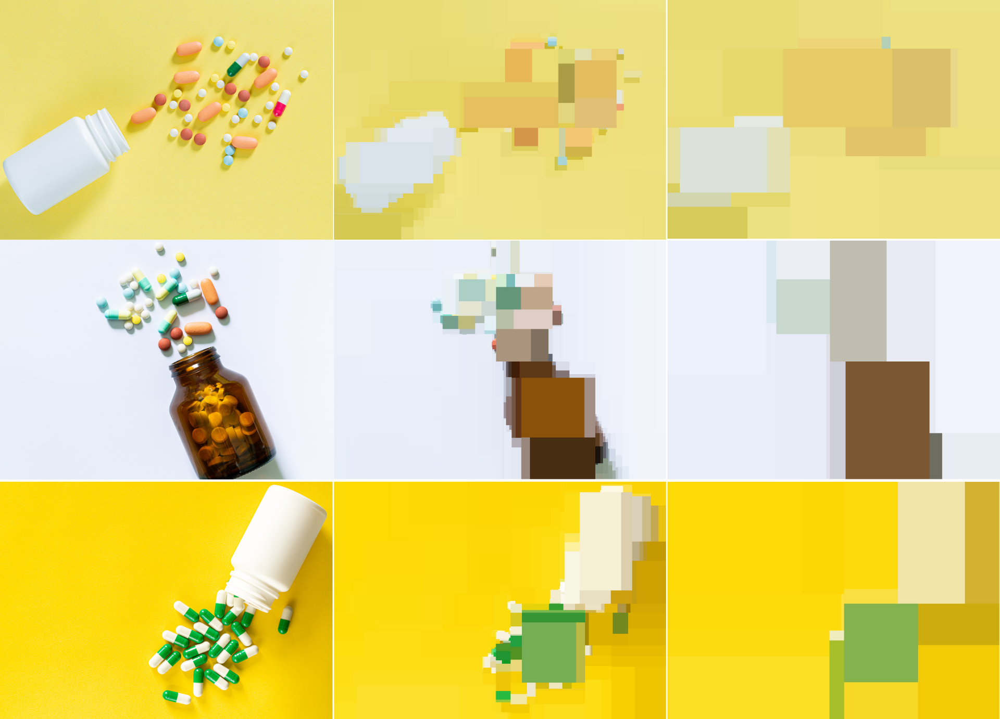
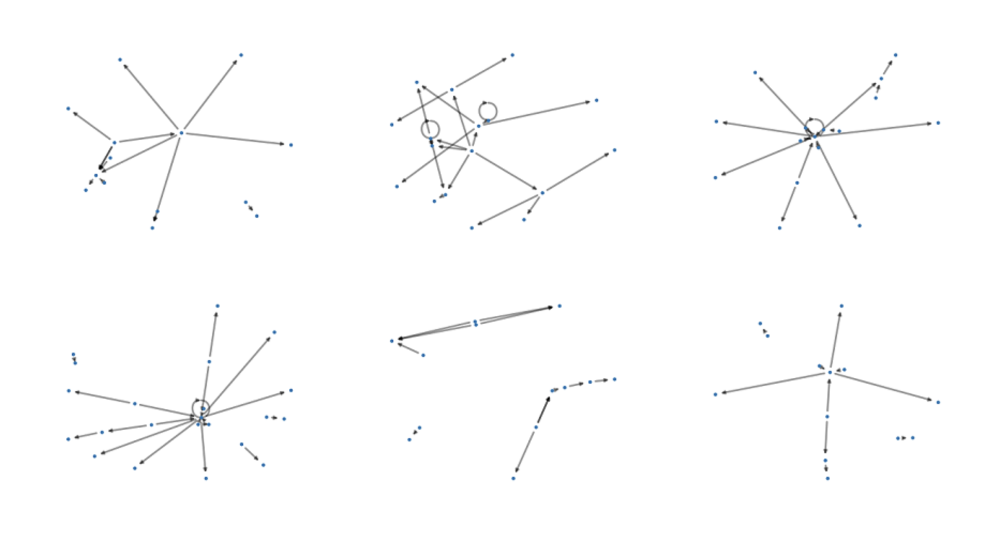

# AI Software Support for Researchers

**Machine learning has become an indispensable tool, but implementing it brings challenges for researchers.**

This page collects software resources that you can build on and so get started quicker. If you can't see what you need, please get in touch. 

[CONTACT US :fontawesome-solid-paper-plane:](mailto:accelerate-mle@cst.cam.ac.uk){ .md-button }

## Resources

[CONTACT US :fontawesome-solid-paper-plane:](mailto:accelerate-mle@cst.cam.ac.uk){ .md-button }

-   :fontawesome-solid-mug-hot:{ .lg .middle } [__AI Cafe__](https://acceleratescience.github.io/machine-learning-clinic)

    ---
    { align=left }
    Our AI Cafe is an in-person drop-in session, with experts from the Accelerate programme there to answer questions. We have run these in colleges, departments and other university locations. If you'd like to host an AI cafe, let us know!

-   :fontawesome-solid-person-chalkboard:{ .lg .middle } [__AI Clinic__](https://forms.office.com/Pages/ResponsePage.aspx?id=RQSlSfq9eUut41R7TzmG6SaVOxbmBOdAg9GzbnrB5IRUNDhIUjNCRkI0SjFaV1Y2VDRTR1pPWTNKOS4u)

    ---
    { align=left }
    Our AI Clinic is the easiest way to ask us for help, by sending us a ticket about your issue. We'll get back to you with a time to talk through your issue. Our tickets range from help with conceptual ideas and proposal writing through to software help and debugging. File a ticket [here](https://forms.office.com/Pages/ResponsePage.aspx?id=RQSlSfq9eUut41R7TzmG6SaVOxbmBOdAg9GzbnrB5IRUNDhIUjNCRkI0SjFaV1Y2VDRTR1pPWTNKOS4u).

-   :fontawesome-solid-computer:{ .lg .middle } [__Accelerate AI Software__](https://github.com/acceleratescience)

    ---
    { align=left }
    We're building a library of software that you can use to get started quickly with the latest AI models. This typically comes out of our training courses and workshops, but you can use the code with or without attending the training courses:
    
    [Data Pipelines](https://github.com/acceleratescience/data-school-Spring23)
    
    [LLM Toolkit](https://github.com/acceleratescience/large-language-models)

    [Diffusion Model Toolkit](https://github.com/acceleratescience/diffusion-models)

    [Publishing and Packaging](https://github.com/acceleratescience/packaging-publishing)
    
    Checkout our [Github page](https://github.com/acceleratescience) for more.

-   :fontawesome-solid-thumbs-up:{ .lg .middle } [__Software Best Practices__](software/best-practice.md)

    ---
    { align=left }
    We’ve collected some resources to help with writing and running AI software

    [Software Best Practices](software/best-practice.md)
    

-   :fontawesome-solid-flask:{ .lg .middle } [__Research Software__](https://github.com/acceleratescience)

    ---
    { align=left }
    Our work across the university has led to the release of open source software for the different research projects, e.g.
    
    [Netts - a project for visualising topics in a conversation](https://pypi.org/project/netts/0.2.0rc1/)
    

