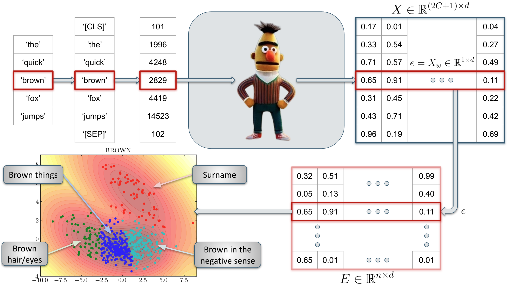
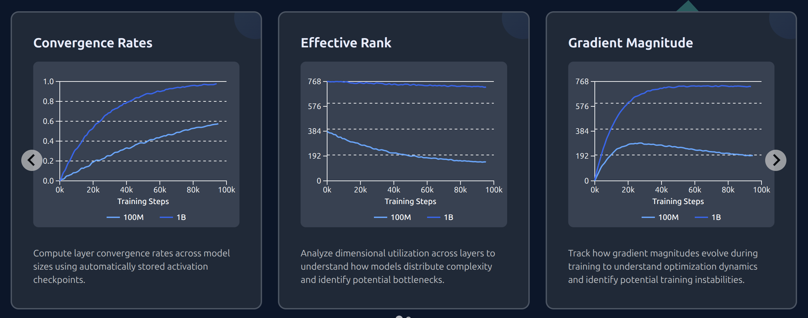
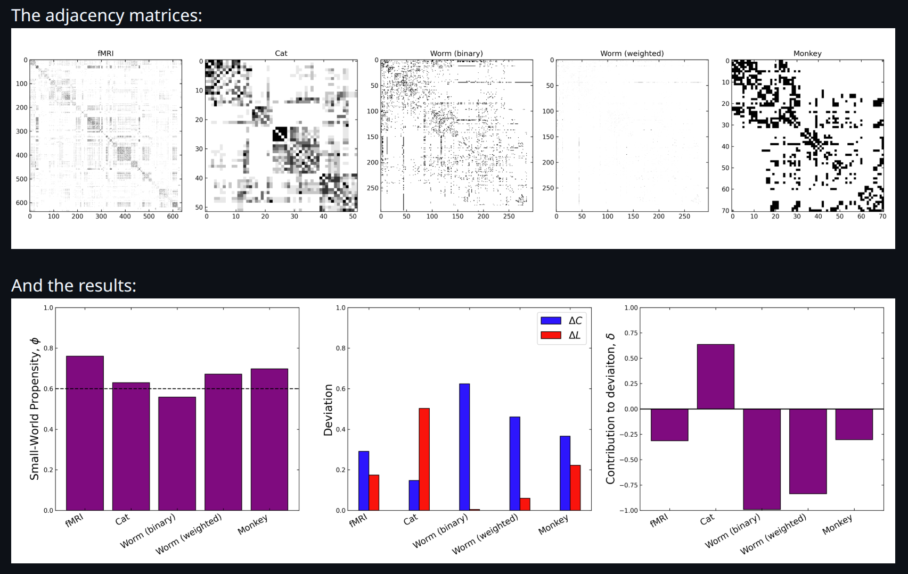
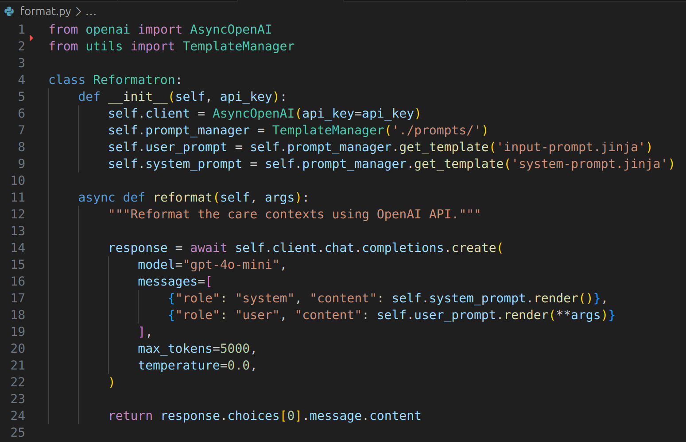

# Accelerate Software and Projects

**Machine learning has become an indispensable tool, but implementing it brings challenges for researchers.**

Here, you can find highlights from our collaborations with researchers across the university. These projects feature new research findings, methodologies, and custom software solutions.

Our role varies significantly: sometimes we provide targeted assistance—adding features to existing tools or solving specific technical challenges—while other times we're involved from the ground up, contributing to research design and methodology development throughout the entire process. But every collaboration is driven by domain expert researchers.

To engage us for your project, please get in touch!

[:fontawesome-solid-paper-plane: &nbsp;&nbsp;&nbsp; CONTACT US](mailto:accelerate-mle@cst.cam.ac.uk){ .md-button .center}

Otherwise, please checkout some of the projects that we've worked on!

<!-- [CONTACT US :fontawesome-solid-paper-plane:](mailto:accelerate-mle@cst.cam.ac.uk){ .md-button }

-   :fontawesome-solid-mug-hot:{ .lg .middle } [__AI Cafe__](https://acceleratescience.github.io/machine-learning-clinic)

    ---
    { align=left }
    Our AI Cafe is an in-person drop-in session, with experts from the Accelerate programme there to answer questions. We have run these in colleges, departments and other university locations. If you'd like to host an AI cafe, let us know!

 -->

<!-- 

-   :fontawesome-solid-person-chalkboard:{ .lg .middle } [__AI Clinic__](https://forms.office.com/Pages/ResponsePage.aspx?id=RQSlSfq9eUut41R7TzmG6SaVOxbmBOdAg9GzbnrB5IRUNDhIUjNCRkI0SjFaV1Y2VDRTR1pPWTNKOS4u)

    ---
    { align=left }
    Our AI Clinic is the easiest way to ask us for help, by sending us a ticket about your issue. We'll get back to you with a time to talk through your issue. Our tickets range from help with conceptual ideas and proposal writing through to software help and debugging. File a ticket [here](https://forms.office.com/Pages/ResponsePage.aspx?id=RQSlSfq9eUut41R7TzmG6SaVOxbmBOdAg9GzbnrB5IRUNDhIUjNCRkI0SjFaV1Y2VDRTR1pPWTNKOS4u).

 -->

<!-- 

-   :fontawesome-solid-computer:{ .lg .middle } [__Accelerate AI Software__](https://github.com/acceleratescience)

    ---
    { align=left }
    We're building a library of software that you can use to get started quickly with the latest AI models. This typically comes out of our training courses and workshops, but you can use the code with or without attending the training courses:
    
    [Data Pipelines](https://github.com/acceleratescience/data-school-Spring23)
    
    [LLM Toolkit](https://github.com/acceleratescience/large-language-models)

    [Diffusion Model Toolkit](https://github.com/acceleratescience/diffusion-models)

    [Publishing and Packaging](https://github.com/acceleratescience/packaging-publishing)
    
    Checkout our [Github page](https://github.com/acceleratescience) for more.

-   :fontawesome-solid-thumbs-up:{ .lg .middle } [__Software Best Practices__](software/best-practice.md)

    ---
    { align=left }
    We’ve collected some resources to help with writing and running AI software

    [Software Best Practices](software/best-practice.md)
    

 -->

## NETTS

-   __Caroline Nettekoven__

    _Psychiatry_

    ---
    
    { align=left }
    
    NETTS constructs networks from a speech transcript that represent the content of what the speaker said. The idea here is that the nodes in the network show the entities that the speaker mentioned, like a cat, a house, etc. (usually nouns). And the edges of the network show the relationships between the entities. We called these networks semantic speech networks.

    [:octicons-mark-github-24: Repo](https://github.com/alan-turing-institute/netts){ .md-button target="_blank" } [:fontawesome-regular-newspaper: Paper](https://academic.oup.com/schizophreniabulletin/article/49/Supplement_2/S142/7083530?login=false){ .md-button target="_blank" } [:fontawesome-solid-book: Blog](https://science.ai.cam.ac.uk/2023/04/03/engineering-a-model-to-help-learn-more-about-schizophrenia){ .md-button target="_blank" }
    
    

## Conceptual Cartography

-   __Nina Haket__

    _Modern and Medieval Languages_

    ---
    
    { align=left }
    
    Philosophers worry that the way we use everyday language may prevent us from accurately portraying the world, or even undermine our ability to think clearly. Nina studies conceptual engineering and is interested in changing some aspects of natural language that are problematic or defective. Changes in language can be difficult to analyse, but Nina's approach uses Large Language Models (LLMs) to identify how words are used, drawing upon data from conversations between real people, and therefore taking a step away from introspective thinking about words.

    [:octicons-mark-github-24: Repo](https://github.com/acceleratescience/conceptual-cartography){ .md-button target="_blank" } [:fontawesome-regular-newspaper: Paper](https://openpublishing.library.umass.edu/scil/article/id/3145/){ .md-button target="_blank" }
    [:fontawesome-solid-book: Blog](https://science.ai.cam.ac.uk/2024/10/08/getting-help-from-the-ai-clinic-to-investigate-word-sense-disambiguation){ .md-button target="_blank" }
    

## Speaking with our Sources

-   __Jacob Forward__

    _History_

    ---
    
    { align=left }
    
    One of the biggest unresolved methodological and theoretical problems facing the history discipline today is source abundance. The haystack of information hiding potentially salient needles of evidence has grown and continues to grow at an exponential rate. Although awareness of this problem is widespread, few solutions exist. AI large language models (LLMs) may offer a path forward. This work presents a research project on experimental applications of LLMs to historical research workflows, focusing on how LLMs can tackle the source abundance problem by enhancing traditional discourse analysis. The project’s case study focuses on two large corpora (over 3 million words each) of spoken addresses and remarks from presidents Franklin D. Roosevelt and Ronald Reagan, digitized by the American Presidency Project.

    This is a work in progress, and more details will be available later on this year.

    [:fontawesome-solid-book: Blog](https://www.hist.cam.ac.uk/news/history-age-ai){ .md-button target="_blank" }
    

## PicoLM

-   __Richard Diehl Martinez__

    _Computer Science and Technology_

    ---
    
    { align=left }
    
    Richard developed Pico with other Master’s and PhD students from the NLP group, alongside researchers from the Accelerate Programme. Pico is a versatile language modelling framework that helps AI researchers develop small, well-founded, and high-performing models that require fewer computing resources. It’s designed to support training on small, bespoke or confidential datasets. This is useful for researchers and companies because model weights can be stored and managed locally without requiring internet access, ensuring users retrain full control of the model and data. 

    [:octicons-mark-github-24: Website](https://www.picolm.io/){ .md-button }
    [:fontawesome-solid-book: Blog](https://science.ai.cam.ac.uk/2025/08/18/how-can-we-help-researchers-build-better-language-models){ .md-button target="_blank" }
    

## Small World Propensity

-   __Ryan Daniels__

    _Computer Science and Technology_

    ---
    
    { align=left }
    
    Small world networks occur everywhere in nature, and there are a number of methods used to measure the small world nature of graphs. However, most techniques are density dependent and do not take into account edge weights. To overcome these limitations, Muldoon et al developed the small world propensity measure in MATLAB. Modern data pipelines however, are often written in Python. In order to integrate the SWP measure into python workflows, we translated the MATLAB implementation into Python, preserving the results and performance. 

    [:octicons-mark-github-24: Repo](https://github.com/rkdan/small_world_propensity){ .md-button target="_blank" }
    

## Patient presentations with LLMs

-   __Brittany Cutten__

    _Clinical Medicine_

    ---
    
    { align=left }
    
    Following some changes to the clinical school's Learning Management System (LMS) some resources needed to be reinstated, one of which was a collection of pages intended to help students structure their approach to common clinical scenarios, such as 'chest pain', abdominal mass' etc. - common symptoms that patients present with to a medical professional.

    This content allows students to think in terms of symptoms, not just diagnoses, which reflects how patients actually present in real life.

    Unfortunately, student feedback indicated that the content was poorly formatted. Trying to reformat all 176 patient presentations would take days. Fortunately, this sounds like a job for an LLM...

    [:octicons-mark-github-24: Repo](https://github.com/rkdan/clinical){ .md-button target="_blank" }
    

## LLM Performance on Obfuscated Tasks

-   __Radzim Sendyka__

    _Computer Science and Technology_

    ---
    
    <!-- { align=left } -->
    
    This work investigates the ability of large language models (LLMs) to recognise and solve tasks which have been obfuscated beyond recognition. Focusing on competitive programming and benchmark tasks (LeetCode and MATH), it compares performance across multiple models and obfuscation methods, such as noise and redaction.

    [:octicons-mark-github-24: Repo](https://github.com/Radzim/obfuscated){ .md-button target="_blank" }[:fontawesome-regular-newspaper: Paper](https://arxiv.org/pdf/2505.23598){ .md-button target="_blank" }
    

